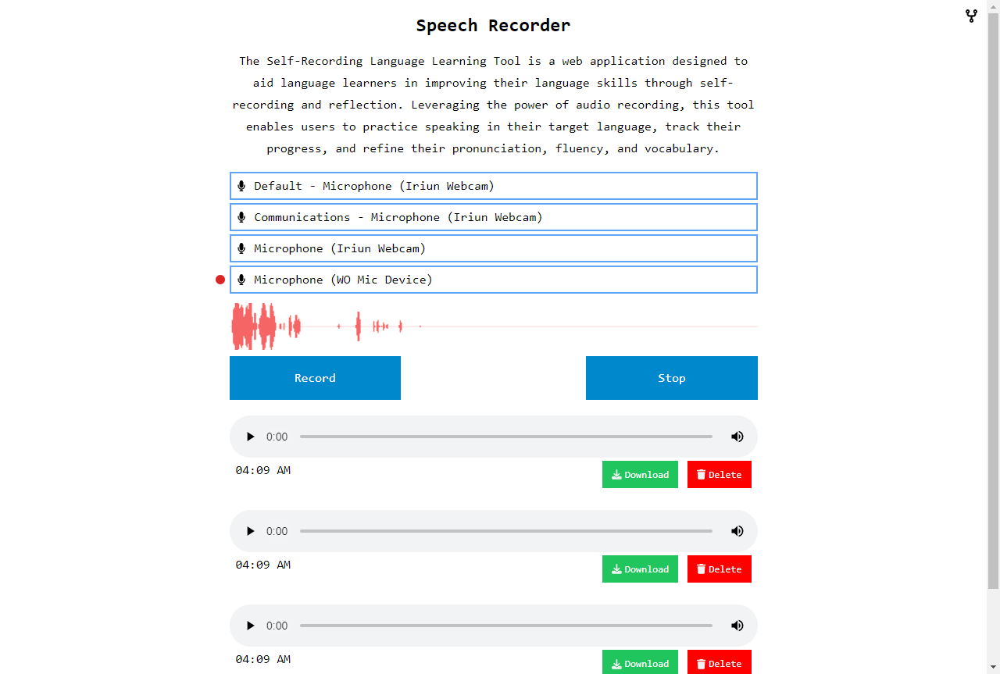

## Speech-recorder

The Self-Recording Language Learning Tool is a web application designed to aid language learners in improving their language skills through self-recording and reflection. Leveraging the power of audio recording,this tool enables users to practice speaking in their target language, track their progress, and refine their pronunciation, fluency, and vocabulary.
